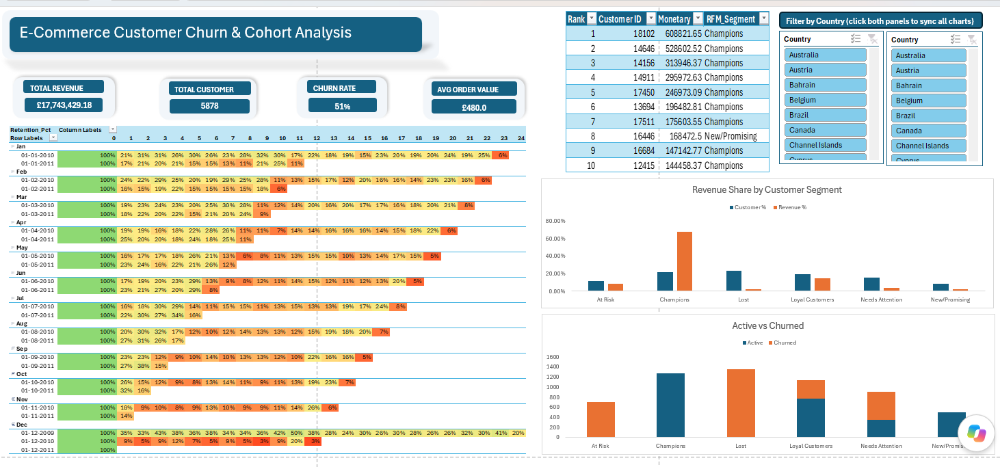

# E-Commerce Customer Churn & Cohort Analysis
### Advanced Excel Portfolio Project | Power Query · Power Pivot · DAX · Interactive Dashboard

---

##  Project Overview

A UK-based online gift-ware retailer wanted to understand **who their most valuable customers are, how fast customers churn, and where revenue is concentrated** — using two years of raw, unfiltered transaction data.

This project takes **1.07 million rows of messy, real-world retail transactions** and turns them into a fully interactive, single-page Excel dashboard — built entirely with native Excel tools, no external add-ins or software.

**Business questions answered:**
- How long do customers stick around before they stop buying?
- Which customers drive the majority of revenue, and which have gone quiet?
- What percentage of the customer base has churned, and how much revenue is at risk?

---

##  Tools & Techniques

| Category | Tools Used |
|---|---|
| **Data Cleaning (ETL)** | Power Query — filtering, type correction, custom columns, text cleaning |
| **Data Modeling** | Power Pivot / Data Model (805K+ rows, optimized for performance) |
| **Analysis Engine** | DAX — `CALCULATE`, `ALLEXCEPT`, `FIRSTNONBLANK`, `DATEDIFF`, `DISTINCTCOUNT` |
| **Customer Scoring** | Advanced formulas — `IFS`, `PERCENTILE`, `XLOOKUP`, `LARGE` + `INDEX/MATCH` |
| **Visualization** | PivotTables, PivotCharts, conditional formatting heatmaps |
| **Dashboard Build** | Linked shapes, grouped objects, dual-cache slicers, single-page interactive layout |

---

##  Dataset

**Source:** [Online Retail II (UCI Machine Learning Repository)](https://archive.ics.uci.edu/dataset/502/online+retail+ii) — real transactional data from a UK-based online retailer, December 2009 to December 2011.

| Metric | Value |
|---|---|
| Raw transaction rows | 1,067,371 |
| Cleaned transaction rows | 805,549 (75.5% retained) |
| Unique customers | 5,878 |
| Date range | Dec 2009 – Dec 2011 (2 years) |
| Countries represented | 40+ |

**Cleaning steps applied:** removed cancelled orders (invoices starting with "C"), removed rows with missing Customer ID, removed non-positive Quantity/Price values, corrected data types, engineered a `Sales` field, and standardized text fields.

---

##  Key Insights

### 1. Revenue is concentrated in a small, loyal core
**Champions represent 21.6% of customers but generate 68% of total revenue** — a clear Pareto pattern. Loyal Customers over-index too, contributing 14.9% of revenue from 19.3% of the customer base.

### 2. Churn is real, but it's concentrated in low-value customers
**50.9% of customers have churned** (no purchase in 90+ days), but churned customers account for only **19.6% of total historical revenue** (£3.47M of £17.74M) — meaning churn is disproportionately hitting infrequent, lower-value buyers rather than core customers.

### 3. Retention drops off sharply after month one
Cohort analysis shows the steepest customer drop-off happens in the **first month** after acquisition — average retention falls from 100% to ~23% almost immediately. From there it declines more gradually, dipping below 15% around month 9–10 and below 10% by month 18, with some month-to-month fluctuation likely tied to seasonal repurchase patterns typical of a gift retailer. The earliest cohort (Dec 2009) — the only one with a full 24-month view — still retained ~20% of customers at month 24.

### 4. A meaningful "win-back" opportunity exists
The **"Lost"** segment (23.3% of customers, fully churned) still represents **2% of historical revenue** — a pool of past value that's gone cold. Combined with "At Risk" customers (12% of customers, 100% churned, 8.8% of revenue), there's a clear, quantifiable case for a targeted win-back campaign.

---

##  Dashboard Preview

The final deliverable is a **single-page interactive dashboard** featuring:
- 4 live KPI cards (Total Revenue, Total Customers, Churn Rate, Avg Order Value)
- A cohort retention heatmap (25 monthly cohorts × 24 months)
- Revenue share by RFM customer segment
- Active vs. Churned breakdown by segment
- Top 10 customers by lifetime revenue
- Dual Country slicers enabling cross-filtering across all visuals

---

##  Methodology Notes

- **RFM Segmentation**: customers scored 1–5 on Recency, Frequency, and Monetary value using quintile-based thresholds, then classified into six segments (Champions, Loyal Customers, At Risk, Lost, New/Promising, Needs Attention).
- **Churn definition**: any customer with no purchase in the 90 days prior to the dataset's final date is flagged "Churned." This is a right-censored dataset (it ends Dec 2011), so customers active near the cutoff will appear churned regardless of true future behavior — a known limitation of any fixed-window churn analysis.
- **Dual-slicer architecture**: Excel slicers cannot connect across OLAP (Data Model) and non-OLAP (worksheet range) pivot caches. Rather than rebuild the entire analysis inside the Data Model, two synchronized, identically-styled Country slicers were used to filter across both cache types — a practical workaround for a real Excel architectural constraint.

---

##  Challenges & Technical Problem-Solving

Real-world data projects rarely go in a straight line. Documenting the actual obstacles — not just the polished output — is part of demonstrating genuine analytical competency.

| # | Problem | Root Cause | Solution | Skill Demonstrated |
|---|---|---|---|---|
| 1 | Loading 805K+ cleaned rows into a worksheet Table repeatedly failed ("Download did not complete") | Excel's worksheet grid isn't built for datasets this large; background refresh was timing out | Loaded the cleaned data into the **Power Pivot Data Model** instead of a flat worksheet Table — a compressed, columnar format built for scale | Recognizing when a dataset has outgrown standard worksheet formulas, and pivoting the architecture accordingly |
| 2 | `Monetary` DAX column threw `#ERROR` — "SUM cannot work with values of type String" | The `Sales` column was silently typed as Text in the Data Model, despite being set to Decimal Number in Power Query | Traced the issue back to the Power Query source, re-applied the correct type there, and refreshed through to the Data Model — rather than patching the symptom in Power Pivot | Root-cause debugging across a multi-layer pipeline (Power Query → Data Model), not just fixing the visible error |
| 3 | RFM scores were silently calculated against the **wrong customer** — every `R_Score`/`F_Score`/`M_Score` was offset by one row | A fill-down operation shifted formula references by one row without any visible error — the sheet looked correct until manually cross-checked | Caught it by spot-checking two customers with known, opposite expected outcomes (very recent vs. very inactive) — a targeted sanity check, not a random glance. Fixed by re-entering formulas as a clean block-paste rather than drag-filling | Building in verification checkpoints rather than trusting formulas at face value — a silent logic bug is far more dangerous than a visible one |
| 4 | Excel's native Slicers couldn't connect a single Country filter across all three pivot tables | `Cohort_Analysis` runs on the Power Pivot Data Model (OLAP cache); `RFM_Summary`/`Churn_Summary` run on a worksheet range (non-OLAP cache) — Excel slicers can't bridge these two cache types | Designed a **dual-slicer pattern**: two identically-styled Country slicers, each wired to its compatible pivot group, positioned and labeled to function as one unified control | Understanding Excel's underlying architecture well enough to work around a genuine platform limitation, rather than assuming something was broken |
| 5 | Power Query auto-detected the `Invoice` column as a Number, silently blocking the "Does Not Begin With C" text filter needed to remove cancellations | Power Query infers column types automatically on load, which doesn't always match the semantic meaning of the data | Explicitly set `Invoice` to Text type before filtering | Not trusting default auto-detection blindly when it conflicts with the data's actual purpose |
| 6 | Cohort retention pivot collapsed multiple years into 12 generic month-name rows (Jan, Feb...) instead of 25 distinct monthly cohorts | Excel automatically groups date fields by month-name when dragged into a pivot's Rows area, merging Jan 2010 and Jan 2011 together | Created a text-based `Cohort_Label` DAX column (e.g. "Dec-2009") — since Excel never auto-groups text fields, this fully bypassed the behavior | Choosing a workaround that eliminates a class of bug entirely, rather than repeatedly patching the same auto-grouping issue |

---

##  File Structure

| Sheet | Contents |
|---|---|
| `Dashboard` | Final interactive single-page view |
| `Cohort_Analysis` | Monthly cohort retention matrix + heatmap |
| `RFM_Scores` | Customer-level R/F/M scores, segments, churn flags |
| `RFM_Summary` | Segment-level customer/revenue breakdown |
| `Churn_Summary` | Churn breakdown by segment |
| *(Data Model)* | Cleaned 805K-row transaction table + DAX measures |

---

##  About This Project

Built end-to-end as a self-directed portfolio project to demonstrate advanced Excel proficiency: ETL with Power Query, data modeling with Power Pivot, DAX-based analysis, and interactive dashboard design — all using tools available in standard Microsoft Excel.

**Connect with me:** [www.linkedin.com/in/ankit-sharma-da] · [ankitsharma74an@gmail.com] · 
